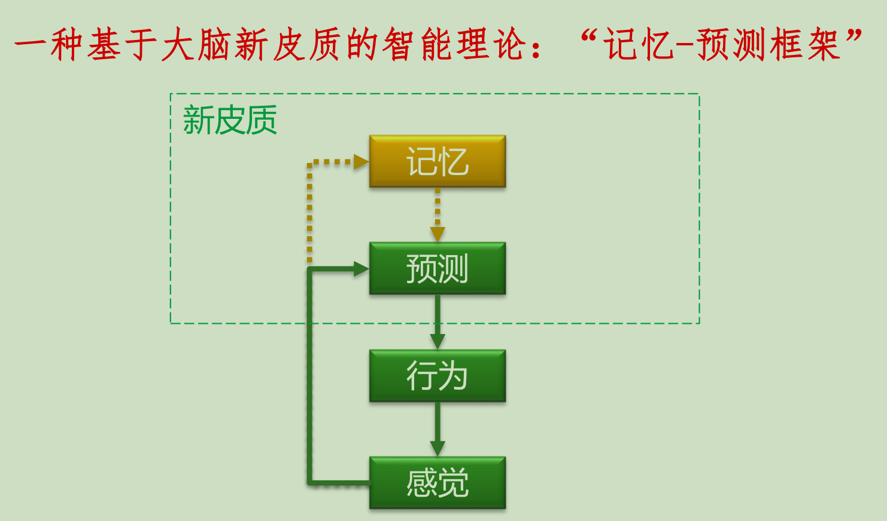

# 脑与认知复习

## Chapter1

### 1.通用人工智能的目标是？

通用人工智能的目标是制造出真正能推理和解决问题的智能机器

## Chapter2

### 1.大脑是以整体方式工作的还是以大脑各特异性部分独立工作而产生的？

- 以颅相学为代表的定位主义：大脑的特定功能由特定脑区负责。
- 聚集场理论：大脑作为一个整体参与行为，全体感觉、知觉和意志占据同一个大脑。

### 2.人工智能中的联结主义

通过模拟人类大脑中神经元的网络来处理信号，信号通过类似于神经元间的连接方式从一个节点传递到另一个节点。

### 3.神经系统的细胞构成

#### a.神经元的功能

进行信息传递和加工，是基本的信息传递和处理单位。

#### b.神经胶质细胞

非神经元细胞，承担多种辅助功能；

#### c.神经胶质细胞的功能

对神经元提供结构支持，保证神经元间的信息传递更为有效。

### 4.神经元的结构

#### 细胞体

包含维持神经元新陈代谢的细胞器。

#### 树突

接收其他神经元的传入信息，具体接收部位是**突触**，因此树突也被称为突触后。

#### 轴突

远离细胞体，将信息传出神经元,也被称为突触前。

### 5.棘

树突表面的球状突起，突触通常位于这些棘上，有时也存在于细胞体等神经元的其他部位。

### 6.突触在树突的分布

突触负责神经元之间的信息传递，在树突上的空间分布具有特异性。（感知位置重叠，突触位置近）

### 7.神经元的形态

根据树突和轴突的相对方向与形态，可将常见的神经元分为四类：

- **单级神经元：**只有一个远离细胞体的突起，该突起能分支形成树突和轴突，常见于无脊椎动物的神经系统。
- **双极神经元：**通过树突接收来自一端的信息，并通过轴突传至另一端，多参与感觉信息传递与加工。
- **假单级神经元：**树突和轴突融合的双极神经元，将躯体感觉信息传递到中枢神经系统。
- **多级神经元：**存在于神经系统的多个区域，参与运动和感觉信息传递与加工，如人脑内的神经元。

形态学相似的神经元倾向于集中在神经系统的某一特有区域，并具有相似的功能。

### 8.胶质细胞

#### a.简介

数量远多于神经元，占脑容量一半以上，自身不传递信息

#### b.分类及对应功能

- 星形胶质细胞：构成血脑屏障，保护中枢神经系统
- 小胶质细胞：在脑组织损伤时发挥作用
- 少突胶质细胞和许旺氏细胞：以同心缠绕的方式包绕在轴突周围形成**髓鞘**，从而改变神经元内的信息传递方式。髓鞘损伤会导致信号传递减慢或阻断。刻意练习可使髓鞘增厚。

### 9.神经回路：

神经元对信息的接收和加工，并将其传递给其他神经元，构成了局部或长程的**神经回路(circuit)**。

### 10.神经元传递信息的主要过程：

接受信息，动作电位的产生，动作电位的传递，神经递质的释放。

### 11.磷脂双分子层：

钠离子、钾离子、蛋白质和其他水溶性分子无法直接通过。

### 12.离子通道

#### 离子通道：

有跨膜蛋白组成，允许$Na^+ 、K ^+和Cl^-$等带电离子通过。

#### 渗透性：

离子通道允许离子穿过细胞膜的程度。

#### 被动型离子通道：

状态不变，只对某些离子开放。

#### 主动型离子通道：

在电、化学或物理刺激下开放或关闭，参与产生动作电位。

### 13.静息电位：

在无信息传递时，神经元的细胞膜内外的电位差形成了**静息电位**

### 14.静息电位的产生原因

产生原因：细胞膜对不同离子的渗透性差异和膜内外的离子浓度梯度。

- 离子通道的渗透性：$K^+>>Na^+$，浓度梯度：$K ^+$(胞内>胞外)，$Na^+$(胞外>胞内)。
- 形成细胞膜**外正内负**的电荷梯度，阻止离子沿浓度梯度流动。
- 达到动态平衡，从而产生静息电位（-40~-90mV）。

### 15.动作电位的产生：

1）快速去极化阶段，动作电位快速上升形成尖峰

- 膜去极化导致$Na^+$离子通道开放；

- $Na^+$离子进入神经元；

- 进一步加强膜去极化，$Na^+$离子快速流入；

- 由上述正反馈引起的快速去极化过程被称为Hodgkin-Huxley(霍奇金-赫胥黎)循环。

2）复极化阶段，动作电位下降

- $Na^+$通道快速减弱，直至完全关闭；

- $K^ +$通道缓慢开放， $K ^+$离子流出神经元；
- 复极化的最后阶段完全由$K ^+$通道控制，此时动作电位处于静息电位之下，进入短暂的超极化状态，随后恢复至静息电位水平

### 16.不应期

复极化过程中神经元暂时不能产生新的动作电位，因此被称为**不应期**。

#### **绝对不应期**：

$Na^+$通道处于失活状态，无论如何刺激均不能产生动作电位。

#### **相对不应期：**

发生在绝对不应期之后，因超极化现象导致更难以达到动作电位的启动阈值，此时只有高于正常强度的刺激才能重新产生动作电位。

### 17.如何确保信息在神经元间传递的速度？

具有高度绝缘性的髓鞘使动作电位沿轴突的传递速度显著增加。

### 18.髓鞘神经纤维的跳跃式传导

- 动作电位在髓鞘轴突的**郎飞氏结**（两段相邻髓鞘之间的无髓鞘部分）上通过跳跃式传导进行快速传递；
- 通过这种跳跃式传导方式，哺乳动物神经元中的信息传递速度可高达120米/秒！

### 19.编码

#### a.在信息传递的过程中，神经元如何通过动作电位对信息进行编码？

`发放率编码`：通过动作电位的发生频率进行编码。

#### b.神经元的发放率编码方式有无缺陷？

受限于动作电位的不应期，神经元的发放率存在上限。

（人类听觉神经元的发放率<1000Hz，因此无法对声音中的高频成分进行编码。

#### c.发放率编码是神经元唯一的信息编码方式吗？

`相关性编码`：信息通过两个或多个邻近神经元的共同激活进行编码。

d.发放率编码可以完成快速的信息编码，因此更具时效性，而相关性编码可以利用更少的动作电位来传递信息。

### 20.人工神经网络的训练问题：

当使用sigmoid作为激活函数时，随着神经网络层数的增加，反向传播训练时误差加大。

神经科学发现：神经元的发放率编码方式具有`稀疏性`的特点。

ReLU(Rectified Linear Unit)只激活部分神经元，增加稀疏性。

### 21.化学突触的信息传递过程

1）动作电位到达轴突末梢；

2）引起末梢去极化，导致$Ca^{2+}$流入末梢；

3）信息编码为不同类型的神经递质分子（>100种），被释放至突触间隙；

4）神经递质扩散至突触后膜，进一步引起突触后神经元的去极化或超极化。

### 22.电突触的信息传递过程

电突触适用于快速传导信息的情况，通过缝隙连接形成穿膜的孔道，可直接传递电信号。

#### 缺点：

不能传递抑制性信息，也不能放大信号。

### 23.神经回路：

也称神经环路，是指相互连接、共同实现某一特定功能的神经元集合。

#### a.兴奋性神经元

兴奋性神经元：被激活时引起突触后神经元更容易产生动作电位。

#### b.抑制性神经元

抑制性神经元：被激活时引起突触后神经元更难以产生动作电位。

#### c.最简单的神经回路

最简单的神经回路仅包含一个感觉神经单元和一个运动神经单元，如膝跳反射的神经回路。

### 24.神经回路的基本模式

神经系统采用了许多种**回路模体**，即神经元之间形成固定模式的连接模式。

#### a.仅含有兴奋性神经元的神经回路中：

收敛式兴奋、发散式兴奋、前馈兴奋、反馈兴奋、复发性兴奋(侧兴奋)回路模体

#### b.同时存在兴奋性神经元与抑制性神经元共同作用的神经回路中：

前馈抑制、反馈抑制、复发性/交叉抑制、侧抑制、去抑制回路模体

### 25.神经回路中的输入突触空间分布

- 兴奋性神经元的输入突触主要位于突触后神经元的树突棘上

- 抑制性神经元的输入突触位于突触后神经元的树突棘、树突轴、细胞体和轴突起始段，从而更有效抑制兴奋性信号

- 神经回路中的调节性神经元：调节性神经元的输入突触分别位于树突、细胞体及突触前（轴突）末梢

### 26.输入突触的空间分布对信息编码具有重要意义

- 从细胞体上突触输入的信号，可在突触后产生最大的兴奋性突触后电压，且上升和衰减都最快

- 距离细胞体越远，突触输入所产生的突触后电压越小，且其上升和衰减速度也越慢

### 27.神经回路中的突触输入信号整合

多个突触输入的信号整合方式分为空间整合和时间整合：

**空间整合**

同一神经元两个不同树突上几乎同时接收到两个突触输入，并在传递过程中进行整合。

**时间整合**

同一突触先后两次接收到两个输入，并在传递过程中进行整合。

## Chapter3

### 1.对大脑神经结构的研究主要在两个层面

- 微观层面：精细解剖学

- 宏观层面：大体解剖学

### 2.神经系统构成

#### 中枢神经系统

包括脑和脊髓，是神经系统中进行命令和控制的部分。

#### 周围神经系统

神经系统中其他组分，负责传递信息。

### 3.脑叶分为

- 额叶

- 顶叶

- 颞叶

- 枕叶

### 4.胼胝体

由发源于皮质神经元的轴突构成，连接左右大脑半球的神经束

### 5.Brodmann分区：

按细胞形态和组织结构划分

- 与脑功能分区不完全重合，52个

### 6.大脑皮质

#### 大脑皮质上存在大量（）的好处

沟回。增加了皮质的总面积，同时便于神经元之间形成紧密的三维联系。

#### 皮质

多层细胞构成，但平均厚度仅为3mm。包含神经元的细胞体、树突和部分轴突，因含细胞体导致颜色较深，也被称为“灰质”。

#### 白质

皮质下是神经元轴突构成的神经束，因颜色较白被称为“白质”。

#### 神经元的数量

大脑皮质中包含300亿个神经元，每个神经元可以产生约1万个突触，总连接数可达到$$3\times10^{14}$$个！

### 7.大脑皮质的分层模式

#### 新皮质

占大脑皮质的90%，由6层细胞组成，其神经元组织方式具有高度特异性。

包括感觉皮质、运动皮质和联合皮质

#### 中间皮质：

- 也由6层神经元构成

- 主要包括扣带回、海马旁回等边缘系统中的皮质

#### 异质皮质：

- 仅含有1-4层神经元

- 包括海马、初级嗅皮质等

### 8.大脑皮质的功能分区

#### 额叶中的运动区

额叶中的运动皮质在运动的执行方面起重要作用

初级运动皮质位于额叶后部，其前侧和腹侧是次级运动皮质。

#### 顶叶中的躯体感觉区

顶叶中的躯体感觉皮质，接受来自丘脑的躯体感觉输入，包括触觉、痛觉、温度和本体感觉（肌肉、关节等运动器官本身产生的感觉）等

#### 枕叶中的视觉加工区

初级视觉皮质, 也称纹状皮质、V1区）位于大脑半球的内侧，仅有少部分位于大脑表面

- 接收丘脑外侧膝状体传来的视觉信息

- 质内6层细胞对视觉信息进行编码和加工

- 初级视觉皮质将视觉信息传递给枕叶中的高级视觉皮质（纹外皮质）进一步处理

#### 颞叶中的听觉加工区

来自耳蜗的听觉信号通过丘脑的内侧膝状体最终到达颞叶上部的听觉皮质，经信息加工后形成对声音的感觉

### 9.联合皮质

新皮质中不能单纯划分为感觉或运动的部分称为联合皮质。

#### 功能：

接收多个皮质区域的输入信息，其中的神经元被多种感觉信息所激活，其作用也很难被单纯划分为感觉或运动。

#### 不同动物大脑中的联合皮质占比

哺乳动物从鼠到猫、猴和人的进化过程中，脑特别是新皮质的面积增加，其中联合皮质的占比在所有哺乳动物中最大。

### 10.前额叶皮质

- 人类前额叶皮质属于联合皮质，占额叶皮质的一半

- 前额叶皮质中包含大量的神经网络，与几乎所有的大脑皮质都存在直接或间接联结

- 前额叶皮质在人类对实现某种目标所采取行动的计划和执行、记忆等认知过程中发挥重要作用

### 11.边缘系统

#### 边缘系统也称边缘叶，包括以下区域：

- 扣带回

- 海马

- 海马旁回

- 丘脑

- 下丘脑

- 杏仁核

#### 功能：

参与情绪、学习和记忆的加工。

### 12.海马

海马位于颞叶的腹内侧，属于异质皮质，仅由3-4层神经元构成

#### 解剖：

- 可分为解剖结构不同的CA1-CA4区

#### 功能：

- 在记忆和学习方面有重要作用

### 13.丘脑

丘脑包括外侧膝状体、内侧膝状体、腹后侧核团等

丘脑被称为“皮质的关口”，除了嗅觉输入以外，其余感觉通道的信息都需要经过丘脑中的相应区域后到达初级感觉皮质

- 视觉：视网膜神经元外侧膝状体初级视皮质

- 听觉：内耳听觉神经元内侧膝状体初级听皮质

- 躯体感觉：躯体感觉神经元腹后侧核团初级躯体感觉皮质

- 丘脑不仅是感觉信息输入大脑的中继站，还接收大量来自相同皮质区域的输入信息

### 14.下丘脑

- 下丘脑对神经系统和内分泌系统非常重要，还参与情绪控制过程，并控制与其底部相连的垂体

- `调节生理周期的节律`

- 输出信息到前额叶皮质、垂体等脑区

- 还可以通过向血液中释放激素进行远距离的神经调控

### 15.基底神经节

- 基底神经节是皮质下多个神经组织的集合，在运动控制中起重要作用

- 基底神经节并不参与对运动的直接控制，而是参与监控运动活动的进程

### 16.脑干

- 脑干介于脑和脊髓之间，包括中脑、脑桥和延髓三个部分。

- 脑干控制呼吸、睡眠等意识，因此损伤相对皮质大多致命。

### 17.中脑

- 参与视觉运动、视觉反射、听觉中继、运动调节。
- 脑干中网状结构是一系列运动和感觉核团的集合，参与唤醒、呼吸、心血管调节、肌肉反射活动、疼痛的调节。

### 18.脑桥和延髓

• 脑桥主体由大量的神经束及其中散布的脑桥核团组成

• 脑桥核团功能包括：

• 听觉和前庭觉（平衡）的功能

• 面部、嘴部的感觉运动

• 部分眼外肌肉的视觉运动

• 延髓位于脑部最末端，与脊髓相连，存在大量与躯体感觉、躯体运动、面/嘴/腹部感觉、心脏、颈/舌/咽等运动相关的核团

### 19.小脑

- 小脑覆盖于脑干上部，处于脑桥水平位置
- 小脑有约110亿神经元，与中枢神经系统其余部分相当！
- 参与运动和感觉信息加工，整合身体和运动信息并调整运动，运动协调流畅

### 20.脊髓

- 脊髓后角内的感觉神经元：从身体的外周感受器中接收感觉信息并传导到大脑皮质

- 脊髓前角内的运动神经元：将大脑产生的运动控制信息传递到相应的肌肉组织

### 21.与输出相关的神经系统主要包括

运动系统、自主神经系统和神经内分泌系统

- 运动系统：控制骨骼肌实现人体运动，

- 自主神经系统：控制平滑肌和心肌的收缩，调控内脏的功能

- 神经内分泌系统：分泌激素调节人的生理和行为，

下丘脑是自主和神经内分泌系统的共同调控中心。

## Chapter4 大脑半球特异化

### 1.

左右大脑半球在整体结构和功能上有很高的相似性，但在少数特定功能上有明显的差异。

### 2.胼胝体

#### 胼胝体结构

胼胝体包含超过2亿条神经纤维，是连接两大脑半球相互交流信息的重要途径，多数连接等位区域，少数连接异位区域。

#### 胼胝体功能（后部、前部）

胼胝体后部：传递感觉信息

胼胝体前部：传递高级语义信息

### 3.胼胝体功能假说

抑制性，两侧大脑竞争信息处理的控制权；

激活性，整合输入信息，促进信息处理。

### 4.裂脑人实验现象及原因

现象1：裂脑人可以用语言确认从右眼输入的视觉信息

原因：视觉信息进入了具有语言信息处理能力的左侧大脑半球

现象2：裂脑人无法用语言确认从左眼输入的视觉信息

原因：视觉信息进入了不具有语言信息处理能力的右侧大脑半球

现象3：裂脑人可以通过左手动作确认从左眼输入的视觉信息

原因：右侧大脑半球具有物体辨识能力

### 5.左右大脑的特异化能力

左侧大脑半球的特异化能力：语言信息处理能力；逻辑推理能力。

右侧大脑半球的特异化能力：对空间信息的处理能力、对陌生人脸的识别能力、语言中的情绪信息处理

### 6.空间能力：

右侧擅长定量的坐标空间关系，

左侧擅长定性的范畴空间关系。

### 7.斯佩里提出“左、右脑分工理论”：

左：语言、逻辑、计算、分析，逻辑规则和概念知识的因果推理。

右：空间、音乐、直觉，物体时空关系的因果感知。

### 8.左、右侧大脑半球相互激活面临的问题

信息处理、输出控制一致性的问题。

将输出功能集中于大脑的某一侧半球 (左侧)，实现输出一致性。

### 9.生成装配器 (GAD) 假说:

大脑的某个单侧半球进化出一个从单词、手势等少量基本元素中产生复杂连续表征的装置，从而实现以生成式认知为主的行为和思考模式。（生成模型）

### 10.大脑半球的视觉信息处理特异化:

- 视觉信息在大脑中被层级化表征，左脑擅长表征局部信息，右脑擅长表征整体信息

- `空间频率假说`：人脑的视觉信息处理系统由空间滤波器构成，右脑低通，左脑高通。

- 两侧信息进一步通过胼胝体整合后形成对物体的全面感知。

- 可解释右脑擅长性别判断，左脑擅长熟悉人脸识别。

### 11.记忆表征特异化：

左脑擅长抽象、范畴化的原型记忆，右脑擅长具体、特例化的样例记忆。

### 12.情感信息处理特异化: 

左脑前额叶皮质擅长积极情感信息处理，右脑前额叶皮质擅长消极情感信息处理。

### 13.概率决策特异化：

左脑解释器构建理论，解释所观察的现象（解释器假说），右脑更擅长简单现象的决策。

### 14.解释器假说：

人的左侧大脑半球中存在一个特殊的认知系统，该系统总是尝试为观察到的现象寻找解释，从而指

导产生相应的行为。

## Chapter5

### 1.知觉是什么？

知觉是一系列组织并解释外界事物的感觉信息加工过程 (视、听、躯体、嗅、味)。

### 2.知觉与感觉的异同：

- 感觉和知觉都由事物作用于感觉器官产生，感觉引起知觉，知觉与感觉同时进行。
- 感觉和知觉都是人类认识世界的初级形式。

- 感觉是对客观事物个别属性的认识，而知觉是通过各种感觉的结合的整体认识。
- 感觉不依赖于个人的知识和经验，知觉却受个人知识经验的影响。

### 3.嗅觉

#### a.占比多少？

嗅觉是最古老的感觉信息，相关基因约占人体全部编码基因的 $3 \%$ 。

#### b.嗅觉最基本的作用

闻到食物或者感受到周围环境的状况，甚至是危险的靠近。

#### c.嗅觉的特点：

1）感受器直接暴露于外界

2）嗅神经不经过丘脑直接到达初级嗅皮质

##### 3）嗅觉信息的传递过程

- 鼻粘膜中有超过1000种的感受器，所产生的感觉信息传递到嗅球中的嗅小体进行整合，再通过嗅神经传递至嗅皮质。

##### 4）初级嗅皮质和次级嗅皮质分别与什么有关？

- 初级嗅皮质与探测气味变化相关，而次级嗅皮质与分辨气味类型相关。

#### d.嗅觉信息传递的神经回路存在三种可能结构：

- 感知同种气味的嗅觉神经元：其细胞体在鼻腔内的空间上聚集，并将轴突发送到同一个嗅小体

- 感知同种气味的嗅觉神经元：其细胞体在鼻腔内的空间上分散，但将轴突发送到同一个嗅小体

- 感知同种气味的嗅觉神经元，其细胞体在鼻腔内的空间上分散，同时也将轴突发送到多个嗅小体

- 每种气味都对应特定的嗅小体激活。

#### e.侧抑制神经回路：

嗅觉信息传递过程中有大量局部中间抑制性神经元参与，构成侧抑制神经回路。

#### f.侧抑制神经回路的功能：

- 提高对相似气体的分辨率

- 用于增益控制(通过调节输入和输出的关系，使输出限制在有限的动态范围内）

- 控制嗅神经动作电位的时间间隔，从而对不同的嗅觉信息（气味类型）进行编码

#### g.嗅觉信息处理的特异化现象

- 左、右鼻孔的大小随时间交替变化

- 高气体流速的鼻孔对高吸收率的气味分子更敏感，而低气体流速的鼻孔对低吸收率的气味分子更敏感

- 具备不同气体流速的嗅觉感受系统可以`同时`感知具有不同吸收率的气味分子

#### h.气味与记忆的联系

气味与个人记忆存在密切联系，因为嗅皮质与边缘系统直接连接。海马损伤的病人气味识别能力也严重受损。

### 4.味觉

有约10000个味蕾。

#### a.味觉是怎么产生的？

味蕾中的味觉感受器被激活后，味觉信息传递至丘脑中的腹后内侧核，然后进入初级味觉皮质和次级味觉皮质, 形成复杂的味知觉。

#### b.基本的味觉信息：

• 咸：矿物质/电解质与水的平衡信息

• 甜：碳水化合物（能量）

• 鲜：蛋白质

• 苦/酸：进化产生的警告信号

• “辣味”不是味觉，而是痛觉信息

### 5.躯体感觉

#### a.躯体感觉是什么？

躯体感觉包括触觉、温度、疼痛、本体感觉等信息。

#### b.躯体感觉的信息类型及感受器

- 一般触觉信息：梅克尔小体
- 轻微触觉信息：迈斯纳小体
- 深部压力信息：环层小体
- 温度信息：鲁菲尼小体
- 痛觉信息：疼痛感受器（有髓鞘：快速反应，无髓鞘：持续疼痛）
- 本体感觉信息：肌肉-肌腱连接处的特化神经元

#### c.躯体感觉的神经回路

躯体感觉信息从感受器产生，通过脊髓、脑干传递至对侧丘脑后，进入初级躯体感觉皮质（S1）、次级躯体感觉皮质（S2）、小脑等多种神经系统组织结构。

#### d.初级躯体感觉皮质和次级躯体感觉皮质

- 初级躯体感觉皮质的面积取决于相应的躯体感觉信息的重要性。
- 次级躯体感觉皮质中的神经元可以编码更复杂的物体纹理和大小等信息。

### 6.听觉

#### a.听觉的主要功能

听觉的主要功能包括对环境的感知和同类的识别交流。

#### b.听觉是怎么产生的？

- 声波引起耳鼓振动及内耳中的液体振荡，刺激内耳耳蜗中的初级听觉感受器毛细胞将机械信号转换成动作电位。
- 听觉信息从耳蜗沿听神经传递，通过丘脑的内侧膝状体后到达初级听觉皮质。

#### c.人的听觉频率

- 听力范围20-20000Hz，最敏感1000~4000Hz。

#### d.听觉神经元的动作电位随刺激周期性发放：

低频信号，动作电位每个周期都发放，高频信号，单个神经元只在部分周期发放。

- 单个神经元不能给出精确的频率信息，感受野频率范围较宽，频率选择特性不好。听觉信息传递过程中，神经元的频率选择特性逐渐增强。

- 听觉信号依赖于多个神经元的联合编码。听觉区具有特定的频率激活空间模式，有助于联合编码。

#### e.基于听觉的空间定位：

- 耳间时差：声音到达两耳的先后顺序和间隔时间

- 耳间强差：声音在两耳分别产生的不同信号强度

### 7.视觉

#### a.

视觉输入 首先以光子时空分布的形式 被视网膜感光细胞接收 并转换为电信号，接着由视网膜上的神经元进行处理，并通过视神经传入大脑。

#### b.视网膜上两类功能互补的感光神经元

视杆细胞：分布在整个视网膜，感受低光刺激，产生低精度视觉，主要在晚上工作，响应慢；

视锥细胞：集中在中央凹，感受强光刺激，主要在白天工作，对不同颜色敏感，产生高精度视觉，响应快。

#### c.根据感光度划分视锥细胞

视锥细胞根据感光度可分为蓝色、绿色和红色。视觉对长波光更加敏锐，红绿占大多数。对短波蓝光的敏感度较低。

#### d.红绿色盲

红色或绿色视椎细胞功能异常

#### e.感光细胞的数量

人的视觉系统包含大约1亿个感光细胞，但仅有约100万视神经将外界的光信号传递到大脑。因此，在视觉处理的过程中，视觉系统会选择`保留有价值的视觉信息，删掉不相关的`。

#### f.感受野是什么？

感受野：视觉神经元仅对有限区域的光信号产生反应，这个区域被称为该神经元的感受野。

#### 中间兴奋-外周抑制神经元

通过侧抑制的神经回路，将抑制信号传输给邻近的视觉神经元突触前末梢，

可放大感光细胞之间的兴奋性差异，

使得下游的神经元能够产生中心-外周型的感受野，

从而提升平行输入信号间的差异，提升信噪比。

#### g.视神经的方向

视神经的颞侧分支沿同侧传递，鼻侧分支交叉到对侧（视交叉），使左视野进入右侧大脑，右视野进入左脑。

#### h.视神经进入大脑的两条通路：

视网膜→丘脑的外侧膝状体→初级视皮质，包含了~90%的视神经

视网膜→皮质下结构（丘脑枕核、中脑上丘等），包含~10%的视神经

#### i.视神经通路的功能特异化：

P通路：视神经→外侧膝状体的小细胞层，神经元感受野小，传递高敏锐度和色觉的视觉信息

M通路：视神经→外侧膝状体的大细胞层，感受野大，传递亮度的视觉信息

#### j.外侧膝状体中的神经元具有与视网膜神经元相似的中心-外周感受野，可被圆形光斑信号激活

#### k.Hubel和Wiesel研究发现：

- 初级视皮层神经元不能被圆形光斑信号激活，但可被特定方向的光条激活。
- 具有中心兴奋-外周抑制的条状感受野的初级视皮质神经元，被称为简单细胞，具有检测图像中线条和轮廓的功能。

- 复杂细胞具有更大、更复杂的感受野，没有具体的激活-抑制区域，但可被特定方向的光条激活

- 复杂细胞，能够识别感受野中所有的线条/轮廓，比简单细胞具有更抽象的线条和轮廓检测能力

#### l.视觉通路神经元的前馈模型假说

视觉通路的神经元感受野在一起构成层次化的前馈计算模型，每个层级都对上一个层级内神经元传来的信息进行处理和表征，最终从光信号中提取出重要的视觉信息。

#### m.初级视皮质的两个组织原则：

- 视网膜拓扑学映射：

  视皮质特定部位接受视网膜对应部位的信息，特定视觉信息在感受野的特定部位呈现

- 功能架构：

  在一个给定的视网膜拓扑映射区域内，具有相同特性的神经元排在与皮质表面相垂直的轴上

#### n.Hubel和Wiesel的实验结果说明：

初级视皮质以垂直的皮质柱为基本单位发挥功能，同一个皮质柱内的神经元具有相似的功能特性。

#### o.初级视皮质柱内的神经环路：

LGN(外侧膝状体) - L4 - L2/3 - L5 - L6

#### p.视觉信息的分布式处理假说: 

大脑对视觉信息处理具有分布式的特点，不同的视皮质区域从视觉信息中分别形成颜色、运动等知觉，进一步整合形成对事物的全面感知。

#### q.视皮质区域的功能特异化：

- V1（初级视皮质）：简单视觉

- V2：图形与物体形状

- V3：视觉信息传递

- V4：颜色知觉

- MT(中颞区，V5):运动知觉，单侧半球MT区损伤对运动知觉影响较小，双侧半球损伤会导致运动知觉丧失。

#### r.MT区神经元的特点：

- 被运动信号激活，对颜色不敏感

- 朝向特定方向运动时，细胞的兴奋性最强

- 神经元的兴奋性与运动速度有关

#### s.V4区

- V4区：颜色知觉，全色盲是由V4区受损引起的，对所有颜色均无法感知，全色盲患者对深度和纹理知觉保持正常，因此仍能辨认出物体
- V4还是参与形状知觉的次级视觉区，颜色可提供物体形状的重要信息。患者无法识别渐变颜色的细微差别，从而丧失了对莫奈作品中人物的形状知觉。

#### t.深度视觉来自于：

双眼视差、运动遮挡、物体在视网膜上的成像大小。因存在多种信息来源，所以深度视觉完全丧失的现象（深度盲）极为罕见。

#### u.空间通路/背侧通路：

处理运动和深度信息，V1-V2-V3-MT，由M通路输入，由顶叶皮质输出。

#### v.内容通路/腹侧通路：

处理形态和颜色信息，V1-V2-V4，由M和P通路输入，颞下皮质输出。

多种感觉信息的整合形成对外界环境统一的多感觉表征，使知觉更加准确、高效。

## Chapter6物体识别

### 1.皮质神经元的特点

#### a.背侧通路流入的顶叶皮质神经元具有以下特点：

- 40%的神经元感受野位于视野中心（中央凹），其他神经元的感受野在中心视野两侧

- 可被物体的空间变化激活，但对物体大小、形状均不敏感

- 以上特点有利于顶叶皮质神经元`检测物体的空间信息`。

#### b.腹侧通路流入的颞下皮质神经元具有以下特点：

- 神经元的感受野全都位于视野中心（中央凹）

- 一部分神经元可被不同形状、大小的物体所激活，但其他神经元仅能被特定复杂物体所激活
- 以上特点有利于颞下皮质神经元`对物体进行识别`

### 2.背侧通路损伤的后果

背侧通路损伤，视觉性共济失调。

### 3.腹侧通路损伤的后果

腹侧通路损伤，视觉失认症。

### 4.背侧和腹侧通路在功能上存在密切联系：

顶叶对腹侧通路的视觉注意控制起关键作用，深度等空间信息对复杂场景中的物体识别也有帮助。

### 5.物体恒常性: 

在视角、距离、光照等因素发生变化的前提下，对物体的视知觉仍然保持不变。

恒常性现象不会影响对相似物体之间细微差别的感知。

#### b.影响恒常性的因素：

观察者位置、亮度变化、遮挡。

### 6.大脑用于物体识别的信息：

- 形状（最重要）

- 颜色、纹理

- 运动

### 7.记忆与形状表征的匹配

- 点>>外侧膝状体神经元

- 边>>V1中的简单细胞

- 平行边、拐角等>>V1中的复杂细胞

- 复杂形状>>腹侧通路中的神经元

- 物体局部>>腹侧通路中的神经元

- 物体>>颞下皮质神经元

### 8.V1区皮质柱的（）可能与（）有关。

长程水平连接；复杂形状表征

### 9.物体识别编码假说:

#### a.单一神经元编码假说: 

通过一个神经元(“知识单元”) 识别复杂物体，激活最终产生对特定物体的知觉。

采用独热表征，噪声大，太脆弱，泛化能力差。

#### b.集群神经元编码假说：

多个相关神经元集体被激活。分布式表征，符合视觉信息的分布式处理假说，噪声小，反脆弱，泛化能力强。（能识别不同的手，包括手套)

### 10.视角相关性:

#### a.视角相关假说: 

物体识别需要依赖特定视角下的物体表征，记忆中保存大量视角，物体识别即快速匹配。

若视角非常罕见，则需要对新视角与记忆中视角的关系进行推理，视角差异大，判断时间就会变长。(神经网络全新视角合成)

#### b.视角不变假说：

建立不受视角影响的物体基本表征进行物体识别。

Marr视觉计算理论，基本表征是主轴和次轴。

可能同时存在视角相关和视角不变识别机制。左脑腹侧通路对重复出现物体的表现与视角无关，右脑有关。

### 11.视觉的物体失认症：

对物体的形状、颜色和动作知觉均正常，但不能根据视觉信息正确识别物体，是一种视觉认知障碍，不是记忆缺陷。

#### a.统觉性失认症:

无法形成正常的物体视觉表征，与腹侧通路损伤有关。对常见物体的形状、颜色知觉无明显异常，但无法正常识别物体，尤其是形状信息不显著时。

1. 患者的物体恒常性丧失，可以识别常见视角和光照，不能识别非常见视角和光照。当视觉信息不能和记忆中存储的物体表征快速匹配，需要进一步推理时，物体识别能力显著下降。与右侧大脑半球视觉皮质损伤密切相关 (右脑在物体恒常性起主导作用)
2. 复杂场景中的恒常性丧失：可以识别单个物体的不同视角和光照，但不能识别重叠物体。缺乏对物体的整体表征，导致无法分离物体。

#### b.联络性失认症：

恒常性正常，但无法对物体进行命名和描述。左侧大脑半球皮质损伤。

#### c.两种患者都不能完成物体的功能匹配任务：

统觉性在视觉信息不常见时无法形成物体表征，联络性能形成物体表征，但是无法获得功能、名称等信息。

### 12.物体识别的认知模型包括的阶段

#### a.知觉分类: 

两侧大脑半球腹侧通路协同形成物体的视觉表征，然后在右侧大脑半球中与记忆存储的物体表征进行匹配，产生物体知觉。

#### b.语义分类: 

在左侧大脑半球中将物体知觉与记忆存储的物体名称、功能等相联系。

#### d.基于范畴的物体知识组织方式假说：

依据不同的范畴关系进行层次化组织（动物、工具）

#### e.基于表征的物体知识组织方式假说：

基于不同表征的组织方式（视觉表征：不同的形状颜色纹理，功能表征：切割)

#### f.

通过建立包含物体视觉、功能表征的人工神经网络模型，对基于表征的物体知识组织方式假说进行验证。

视觉表征神经元无法激活，难以识别生物，对无生命物体的识别能力降低相对有限。功能表征相反。

#### g.范畴特异化的本质

范畴特异化的本质是识别生物和非生物的信息来源不同。失认症患者通常对无生命物体的识别能力更好，因为使用物体时的其他感觉表征补充了视觉识别能力的不足。

### 13.面孔失认症：

俗称“脸盲症”，指对陌生、熟悉甚至本人的视觉识别能力缺陷

#### a.人脑存在独立于其他物体识别的面孔识别系统

人脑存在独立于其他物体识别的面孔识别系统。

（证据：物体失认症患者可以识别面孔、面孔失认症患者可以识别精细物体，对倒立面孔识别能力更好)

颞下皮质存在可被面孔特异性激活的神经元。

#### b.面孔视觉信息流动方向：

ML/MF区：被特定视角的面孔激活 

-> AL区：能被特定视角面孔激活+镜像激活 

-> AM区：能被不同视角的面孔激活。

#### c.梭状回面孔区

颞叶中存在梭状回面孔区 (FFA)，在面孔识别中起重要作用。

对其它物体进行精细识别时，除面孔区之外的梭状回区域被激活。

其中面孔区FFA负责面孔识别，而其余的梭状回区域负责其他物体的精细识别。

### 14.面孔识别的皮质通路

视觉信息的流动方向：

视皮质 -> 枕叶面孔区（面孔局部的视觉信息处理）/颞上沟（面孔表情） -> 梭状回面孔区 (面孔整体信息处理、面孔识别)

### 15.面孔识别的特异化

右脑在自己面孔的识别中起主导作用。右脑在看到自己照片时有更明显的激活， (癫痫) 可以从合成照片中识别自己的面孔。

#### a.物体识别的双系统假说: 

大脑存在整体视觉信息处理系统和局部视觉信息处理系统。

### 16.马尔视觉计算理论，物体推得形状信息三个表征阶段:

- 初始简图: 亮度变化和局部几何特征。

- 2.5维简图：处理初始简图，得到表面几何特征的表征，表面朝向，观察者的距离，提供表面形状的多方面信息。

- 三维模型: 2.5 维简图坐标系以观察者为中心，变为以物体为中心。

## Chapter7

### 1.什么是记忆？

记忆：动物通过感受和反应的过程进行学习，并通过大脑神经结构带来持续性的改变，从而将所学知识存储起来的过程

### 2.记忆的分类

感觉记忆：几毫秒-几秒，不需要特别注意

短期记忆：几秒-几分钟，短期内记忆信息

长期记忆：几天-数年，又分为长期陈述性记忆和长期非陈述性记忆

### 3.记忆分为3个阶段

- 编码：对输入信息的处理和临时存储
  - 获得：经历或学习某项事物后记忆的最初形成阶段
  - 巩固：新获取的记忆被巩固加深

- 存储：记忆被存储在神经系统某处的过程

- 提取：回想已有记忆的过程

### 4.在持续时间上，记忆可以分为

短期记忆、长期记忆

### 5.什么是工作记忆？

工作记忆是短期记忆的一种，指在认知过程中对信息和事物的短期存储。

### 6.工作记忆的容量

一个人短时间内能记住的项目个数，正常人能记住5-9个项目

### 7.工作记忆的来源

可来自感觉记忆的输入，也可以从长期记忆中提取获得

### 8.工作记忆的认知机制

- 感觉信息形成短暂的感觉记忆

- 通过注意过程，选择信息进入短期存储(工作记忆）

- 通过复述转入长期存储（长期记忆）

### 9.长期记忆的类型

#### 陈述性记忆：

也被称为外显记忆，是指那些对先前已知事物（如姓名、事实、事件）有意识的回忆，我们在日常生活中经常提到的记忆通常都属于外显记忆。

#### 非陈述性记忆：

又叫内隐记忆，帮助人们通过已有的经验掌握完成某项任务的技能，这一过程不需要有意识的记忆。

### 10.陈述性记忆包括：

情节记忆（事件）：自传式记忆，对以往事件的个人意识

语义记忆（事实）：世界知识，通常与情节记忆无关

### 11.非陈述性记忆包括：

- 程序性记忆：包含各种自动技能（运动等）和认知技能（读写等）的学习

- 知觉表征系统：感知系统中发挥作用，更快地识别以前出现过的物体或词语（知觉启动）

- 非联想学习

- 经典的条件反射

### 12.突触权值矩阵在理论上可以存储巨量信息。

### 13.学习的本质

是根据经历的事件改变突触矩阵的权值，即改变突触连接的方式，如形成、消失、增强、减弱，也称为**突触可塑性**

### 14.赫布法则

如果神经元A重复或持续刺激神经元B，则它们的活动模式相关，导致它们之间的突触连接增强

赫布法则的延伸理论：如果神经元A对神经元B的兴奋性刺激反复失败，使得他们的活动模式不相关，则它们之间的突触连接减弱。

### 15.长时程增强LTP

对海马中的神经元施加高频电刺激后，神经元的突触传递效率提高，而且可以持续几个小时甚至几天，被称为长时程增强。

对LTP相对的机制是长时程抑制（LTD）,由低频刺激诱导产生。

### 16.LTP具有的特点

输入特异性、协同性和关联性

### 17.脉冲时序相关可塑性(STDP)

### 18.学习的类型

简单学习类型：

• 习惯化：对重复出现的刺激响应强度降低

• 敏化：对出现在某有害刺激之后的刺激响应强度增加的过程

突触效能抑制造成习惯化，而突触效能增强造成敏化

### 19.高级的学习类型

经典条件化/条件反射

操作性条件化

### 20.条件化学习的特点

• 经典条件化和操作性条件化的共同特点：

- 时机(发生顺序和间隔时间)对条件化的有效性极为重要
  - 经典条件化：条件刺激→非条件刺激
  - 操作性条件化：行为→强化因子,间隔短条件化效果最好

- 条件化学习的消退现象
  - 经典条件化：当条件刺激重复性地不与非条件刺激配对出现时，条件化的反应会逐渐消失
  - 操作性条件化：当强化因子没有在特定行为出现后重复性出现时，这一行动也会消失

### 21.恐惧条件化的神经回路

- 杏仁核是高等动物的情绪记忆和信息处理中心，在恐惧条件化学习中具有核心作用，而中央杏仁核是对恐惧反应的输出部分。

- 听觉条件刺激：听觉丘脑/听皮质→杏仁核外侧核→中央杏仁核
- 场景条件刺激：海马→杏仁核基底核→中央杏仁核
- 引发恐惧反应的非条件刺激(电击)：1）躯体感觉丘脑→杏仁核外侧核→中央杏仁核，2）痛觉通路(臂旁核)→中央杏仁核

### 22.哪些脑区控制动物在奖励刺激下不断重复行为？

中脑的腹侧被盖区(VTA)和黑质中多巴胺神经元在奖赏学习中起重要作用

VTA→伏隔核和黑质→纹状体两条通路均参与学习有助于获得奖励性刺激的行为反应

### 23.多巴胺神经元以两种不同的模式产生兴奋：

紧张性模式：维持较低但较为稳定的基本放电频率

相位性模式：响应特定刺激以集中放电的形式兴奋

### 24.奖励预测误差

多巴胺神经元的相位性兴奋并不是针对奖赏本身，而是反映了实际奖赏和预期奖赏直接的差异，又叫奖励预测误差

### 25.智能的本质是

**预测**

### 26.

